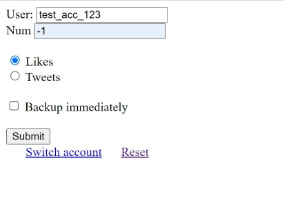

# Old likes search

A tool to search over your Twitter likes and backing them up on AWS S3 with static preview hosting.

### AWS setup
To set up a full backup with aws:
1) Log into an account with Free Tier available or create a new one
2) In S3 set up a bucket if not already. https://docs.aws.amazon.com/AmazonS3/latest/userguide/HostingWebsiteOnS3Setup.html At least up to step 5.
3) Set up a protected hosting https://austinlasseter.medium.com/build-a-password-protected-website-using-aws-lambda-and-cloudfront-3743cc4d09b6
4) Create AWS credentials in Security Credentials for the use in step 5.

### General use
To backup user`s twitter likes do:
1) Clone https://github.com/MikeTkachuk/old_likes_search/
2) Get twitter app consumer keys (You need an account with access to API for that)
   If forgot Go to https://developer.twitter.com/en/portal/apps/<app>/keys
   And regenerate App consumer keys
3) Open download_data.py
4) Paste keys into the code in lines 30-31 (may change)
5) Start server and follow the sign in and auth process
6) Enter the username, number of tweets, etc., and press Submit
    
7) Find your archived tweets in ./downloads`
8) Modify archive paths in `full_backup.py` and run the script
9) Your tweets are successfully backed up in a separate folder on S3 website 
(you get the link and login info from AWS setup section)

